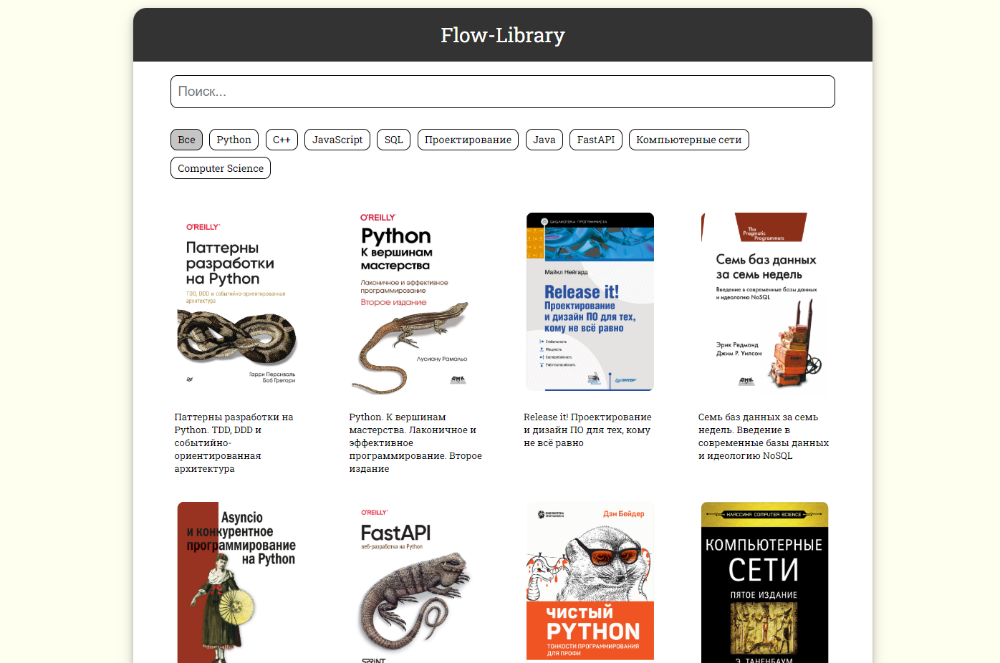
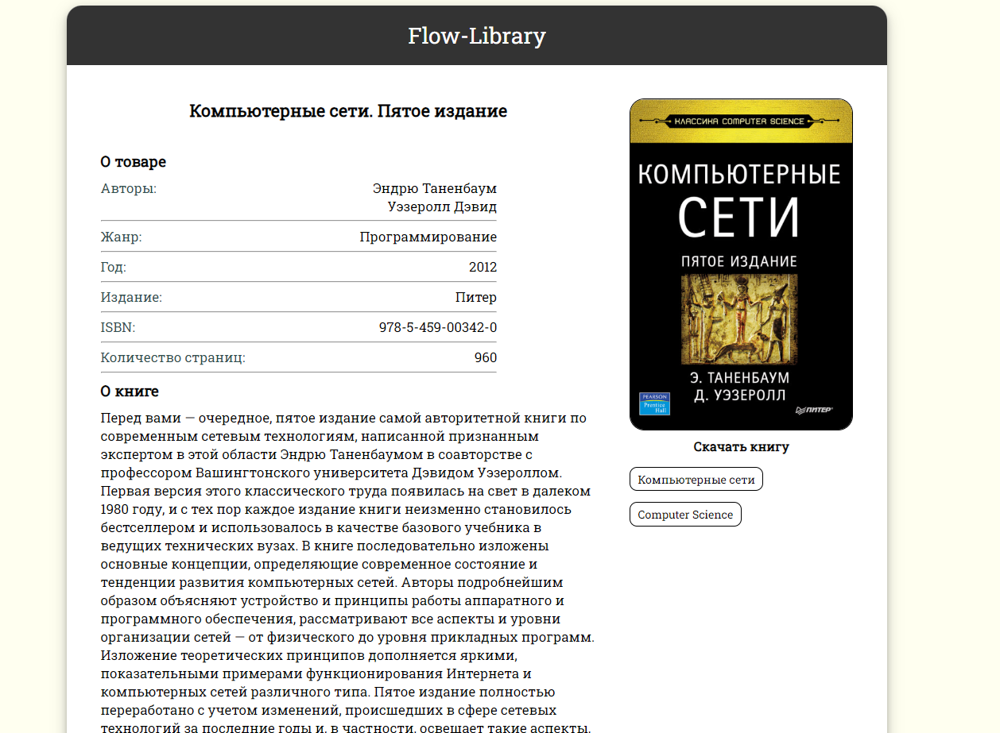

#  Flow-Library

**Flow-Library** - это сайт-библиотека для программистов. Тут можно поискать, и бесплатно почитать книги.





# Содержание

- **[Технологии и инструменты](#технологии-и-инструменты)**
- **[Установка и запуск](#установка-и-запуск)**
- **[API](#api)**

## Технологии и инструменты

### Языки программирования и фреймворки

- **Python 3.11**
- **Django 5**
- **Django REST Framework (DRF)**
- **Vue.js**

### Базы данных
- **PostgreSQL**

### Web технологии
- **HTML**
- **CSS**
- **JavaScript**

## Установка и запуск

### 1. Установите зависимости Python в flow_library_server/:

```shell
poetry install
```

### 2. Запустите runserver.bat в корне проекта

```shell
.\runserver.bat
```

## API

### 1. Получить список книг

```api/books/```


### 2. Получить список тегов

```api/tags/```

